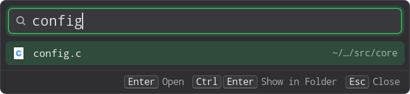

# Torchlight

A Spotlight-style launcher for Linux, written in C. Press a shortcut, type a few
letters, and open an application, a settings panel, a file or a folder.



- **Forgiving search.** Matches prefixes, initials, abbreviations (`prjnts` finds
  `projectNotes.md`), one-letter typos (`raedme` finds `README.md`) and folder
  context (`work notes`).
- **Fast and always current.** A resident daemon keeps the index in memory and
  follows file changes as they happen. Typing stays under about 5 ms at the 95th
  percentile with 500,000 paths ([evaluation](docs/evaluation.md)).
- **Switch to open windows.** Running apps list their open windows beneath them
  (on X11). Enter switches to the most recent one; pick another or open a new
  window from the list.
- **Learns what you use.** Files and apps you open rank higher. History stays on
  your machine and can be turned off or cleared.
- **Looks native.** The GTK 4 popup follows your desktop theme, accent color and
  font, and is fully keyboard driven.
- **Private.** Only names and paths are indexed; file contents are never read.

Tested on Linux Mint (Cinnamon, X11). On Wayland, window placement and focus are
up to the compositor.

## Build

Install the build dependencies (Debian, Ubuntu, Mint):

```sh
sudo apt install build-essential pkg-config libsqlite3-dev libutf8proc-dev \
    libgtk-4-dev libglib2.0-dev libx11-dev
```

You also need Rust 1.89 or newer (for example from [rustup](https://rustup.rs)) to
compile the vendored [Frizbee](third_party/README.md) fuzzy matcher. GTK 4.14 or
newer is required.

```sh
make                             # debug build: build/torchlight, torchlightd, torchlight-gtk
make build/torchlightd-release   # optimized daemon, about half the tail latency
```

The first `make` compiles Frizbee offline, which takes about four minutes; later
builds reuse it.

## Install and set up the desktop launcher

```sh
make install                     # installs into ~/.local (set PREFIX to change it)
systemctl --user daemon-reload
systemctl --user import-environment DISPLAY XDG_CURRENT_DESKTOP DBUS_SESSION_BUS_ADDRESS
systemctl --user enable --now torchlightd.service
```

This installs the three programs, a desktop entry and a systemd user service for
the daemon. Make sure `~/.local/bin` is on your PATH.

Then bind a keyboard shortcut to the popup. In Cinnamon, open
**System Settings → Keyboard → Shortcuts → Custom Shortcuts**, add a shortcut
with the command `/home/YOUR_USER/.local/bin/torchlight-gtk --toggle`, and bind it
to a free key such as Super+Space.

| Key | Action |
|---|---|
| Type | Search apps, settings, files and folders |
| ↑ ↓ | Move the selection |
| Enter | Open the selected item |
| Ctrl+Enter | Show the file in its folder |
| Esc | Close |

[Desktop setup](docs/desktop-setup.md) covers other desktops, staged installs and
service troubleshooting.

## Try it without installing

Run the daemon in one terminal:

```sh
./build/torchlightd
```

Then, in another terminal, open the popup or search from the command line:

```sh
./build/torchlight-gtk --toggle
./build/torchlight query "prjnts"             # abbreviation
./build/torchlight query --limit 20 "work notes"
./build/torchlight query --json "report"      # ids, exact paths and status
./build/torchlight query --null "report"      # exact paths, NUL-separated, for scripts
./build/torchlight status
./build/torchlight reconcile                  # rescan in the background
./build/torchlight history-clear              # forget search and open history
```

Every word of a query must match the file name or one of its folders; a word
containing `/` can match across the whole path. Put `--` before a query that
starts with a dash.

With the daemon stopped, you can index and search directly:

```sh
./build/torchlight index                      # sync the configured roots
./build/torchlight index "$HOME/Documents"    # or refresh specific folders
./build/torchlight query --db ~/.local/share/torchlight/catalog.db "prjnts"
```

## Configuration

Torchlight indexes your home folder by default. To choose folders, create
`~/.config/torchlight/config` (or `$XDG_CONFIG_HOME/torchlight/config`):

```text
# Folders to index. "~/" expands to your home folder.
root = ~/Documents
root = ~/projects
# Hidden or normally skipped folders to index anyway.
allow = ~/.config/nvim
```

Hidden folders and `node_modules`, `target`, `build` and `__pycache__` are skipped
unless allowed; hidden files are still searchable. Symlinked folders are not
followed. The catalog and history live in `~/.local/share/torchlight/`.

Daemon options:

| Option | Meaning |
|---|---|
| `--no-history` | Don't record what you open |
| `--history-days N` | Keep history for N days (default 30) |
| `--rescan-ms N` | Milliseconds between full background rescans (default 30000) |
| `--socket PATH` | Use another socket (also accepted by `torchlight`) |
| `--db PATH`, `--config PATH` | Use another catalog or configuration file |
| `--watch-capacity N`, `--max-entries N`, `--max-path-bytes N` | Resource limits |
| `--model PATH.tlm` | Enable optional semantic search (see below) |

To change the options of the installed service, run
`systemctl --user edit torchlightd`, set a new `ExecStart=`, then restart it.

### Optional semantic search

Torchlight can also match by meaning using a local
[Potion](docs/m4-model-evaluation.md) model passed with `--model`. It works and is
tested, but it is parked: it is slower on large catalogs and is not enabled by
default ([ADR 0032](docs/adr/0032-park-semantic-search.md)).

## Development

```sh
make test               # unit, CLI and daemon tests under ASan, UBSan and leak checks
make lint               # clang-tidy and cppcheck; warnings fail the build
make format             # clang-format
make bench              # search latency and ranking quality at 50k and 500k paths
make bench-daemon       # daemon startup, IPC, indexing load, update lag and memory
make test-ui-isolated   # popup acceptance on a private X display (needs xvfb, xdotool, metacity)
make bench-ui           # popup paint timing during a 500k rebuild
make test-ui            # popup keyboard acceptance on your own X11 session (needs xdotool)
```

Lint needs `clang-format`, `clang-tidy` and `cppcheck`. A local `machine.mk`
(ignored by git) can point the build at custom tool or dependency locations
(`DEPS_PREFIX`, `CLANG_TIDY`, `CPPCHECK`). To benchmark against your own files:

```sh
./scripts/make_corpus.sh /usr /tmp/usr.paths   # NUL-separated path list; keep it private
make bench BENCH_PATHS=/tmp/usr.paths
```

After rebuilding, restart the daemon (`systemctl --user restart torchlightd`) and
quit any running popup (`pkill -x torchlight-gtk`) so your next shortcut press
starts the new one.

Contributors should read [CLAUDE.md](CLAUDE.md) for the code rules.

## Documentation

- [Docs index](docs/README.md): where everything is
- [Architecture](docs/architecture.md): components, data flow and dependencies
- [Plan](PLAN.md) and [milestone status](docs/milestone-status.md)
- [Evaluation](docs/evaluation.md): measurements and known limits
- [Design decisions](docs/adr/): the ADRs
