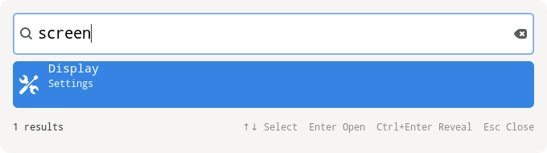

# M3 implementation and verification

Recorded 3 October 2026 on Linux Mint 22.2, Cinnamon X11, GTK4 4.14.5.

M3 is implemented: resident XDG application/settings discovery, mixed daemon
results, localized name/generic-name/keyword matching, GTK4 keyboard popup,
native desktop activation, exact-byte file open/reveal, asynchronous IPC/history,
and installable desktop/systemd integration. M4 semantic search is next.
See [desktop setup](desktop-setup.md) and [ADR 0015](adr/0015-m3-desktop-catalog-and-launcher.md).

## Automated checks

- `make`: all three executables, C17 strict warnings.
- `make test`: ASan/UBSan/leaks, allocation-free queries, unit tests and CLI,
  desktop-catalog and daemon integration.
- `make lint`: clang-tidy and cppcheck, including GTK sources; zero warnings.
- `make bench` and `make bench-daemon`: 50k/500k corpus runs, preserved below.
- `desktop-file-validate`: launcher desktop entry accepted.
- `systemd-analyze --user verify`: unit accepted with staged executable path.
- `make install DESTDIR=/tmp/torchlight-m3-install`: complete reviewable install.
- `AGENTS.md` and `CLAUDE.md`: identical, unchanged.

Desktop fixtures verify hidden/incompatible entries, NoDisplay, TryExec,
user-over-system masking, duplicate and nested desktop ids, localized names,
generic names and keywords, installed application/settings kinds, removed and
changed entries, newly installed entries, resolve and deduplicated/cleared
history. Existing daemon tests retain file-only XDG fixtures; the new desktop
suite tests mixed behavior independently.

The popup model tests obsolete phases, deliberate selection position/id retention
outside top-k, exact non-UTF-8 paths, visible control escaping and decoded-NUL
rejection. IPC tests fragment lexical/final frames and reject wrong request ids
and EOF without a terminal frame. Action worker tests prove byte-preserving argv,
no shell interpolation, native desktop `%k` expansion and revision rejection
before launching changed entries. An isolated FileManager1 fixture verifies
exact raw URI bytes and the parent fallback for non-UTF-8 names.

## Cinnamon desktop checks

`tests/test_popup.py` exercises actual X11 focus and keyboard input with isolated
fixture applications. Show, Escape, repeated toggle, single-instance reuse,
rapid typing, Display/screen/resolution/Sound/Keyboard activation and accepted
history passed. Captured native widgets were inspected in light, dark and
high-contrast themes. Names and selected subtitles remain readable and footer
hints fit the window.

The follow-up empty-state regression verifies that opening/clearing the popup
shows no default root result, Enter is inert, whitespace-only input is empty,
pending responses cannot repopulate the model and no blank query is recorded.
See [ADR 0016](adr/0016-empty-popup-without-recommendations.md).

| Test override | First focus | Repeat focus | Physical popup width |
|---|---:|---:|---:|
| Adwaita, GTK scale 1 | 215.7 ms | 85.1 ms | 680 px |
| Adwaita dark, font-scale override 1.5 | 357.1 ms | 73.1 ms | 680 px |
| HighContrast, GTK scale 2 | 237.6 ms | 70.4 ms | 1360 px |

These are individual subprocess-to-active-window measurements, including GTK
startup and desktop activation, not latency percentiles or first-paint timing.
The font override is not a verification of Cinnamon fractional monitor scaling.
The 3840×2160 target monitor placed the 680-pixel popup at x=1580, y=424; at scale
2 it was 1360 pixels wide at x=1240, y=424. No desktop settings were changed.

The separate `tests/test_popup_native.py` probe verified the installed native
entries: `display`, `screen` and `resolution` find
`cinnamon-display-panel.desktop`; `sound` finds
`cinnamon-settings-sound.desktop`; `keyboard` finds
`cinnamon-settings-keyboard.desktop`. Keyboard activation opened actual windows
named Display, Sound and Keyboard. Only newly created test panels were closed
through normal window-manager actions. Ctrl+Enter on a filename containing
invalid UTF-8, quotes and a control byte also opened its parent in native Nemo.

## Benchmarks and limits

Raw runs: [lexical](../tests/bench/results/2026-10-03-m3-lexical.txt) and
[daemon](../tests/bench/results/2026-10-03-m3-daemon.txt). File benchmarks isolate
XDG applications to keep their corpus comparable to M1/M2. Labeled quality and
all 9/9 fixtures remain unchanged. Some checks ran concurrently, so these are
recorded observations rather than an attribution of timing changes to M3.

| Requested paths | Engine p95 | IPC p95 | IPC p99 | Update lag |
|---|---:|---:|---:|---:|
| 50k (49,569 saved) | 0.805 ms | 0.917 ms | 1.725 ms | 395 ms |
| 500k (494,362 saved) | 6.929 ms | 7.265 ms | 12.612 ms | 4,973 ms |

The separate lexical benchmark p95 was 0.808 ms at 50k and 7.059 ms at 500k.
Daemon IPC p95 during a 500k rebuild was 10.806 ms. After update, RSS was 548,516
KiB and peak was 660,528 KiB at 500k. Full-engine rebuild/update cost and the
original 5 ms lexical target remain optimization work; the earlier accepted
readiness baseline was approximately 6 ms. M3 introduces no scoring changes to
the file engine.

Wayland activation/placement, actual fractional monitor scaling, a small monitor,
multi-monitor behavior, screen-reader interaction and separately timed GUI
input-to-results under a 500k rebuild remain additional platform acceptance work.
Native UTF-8 quoted-filename reveal was verified. Nemo acknowledged a raw-byte
filename without creating a visible window; the launcher now additionally opens
its parent for non-UTF-8 targets. That fallback was verified in native Nemo, and
the URI and fallback are covered by an isolated D-Bus/action regression.
Locale/data-path/desktop environment changes require
restarting the daemon. Applications refresh once a second plus scan/build time.

The service/desktop files are staged and validated; enabling the service and
choosing a global shortcut are installation steps in desktop setup. Existing
user services and shortcuts were preserved.
